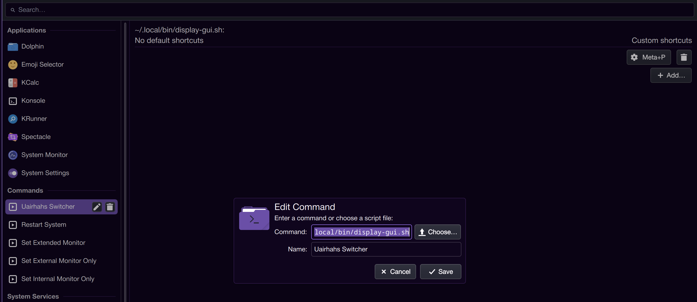

# Airhahs Display Cycler for KDE

A utility for cycling through display configurations in KDE Plasma targeting mainly Laptop dock users with a single external monitor (niche use case, I know). This is primarily intended for personal use and backup as I share no affiliation with KDE or any of it's products, affiliates or services.


## Description

This tool allows you to quickly switch between three different display display configurations (single monitor internel only, single monitor external only, extended display with external dispaly centered above internal) in KDE Plasma environments.

## Dependancies

- KDE Plasma 5.x or later
- kscreen utilities
- rofi
- libkscreen
- GeistMono Nerd Font
  > (or any other preferred font, update in display-gui.sh if needed)

## Installation

```bash
# Clone the repository
git clone https://github.com/uairhahs/display-cycler-for-kde.git
cd display-cycler-for-kde
```

- Note: if you have issues use:

  ```bash
    chown `whoami`:`whoami` .
  ```

  > and/or:

  ```bash
    chmod 755 -R .
  ```

  > commands to assure correct ownership and permission on the scripts

```bash
# copy to desired path (preferably ~/.local/bin)
sudo cp . ~/.local/bin
```

## Usage

```bash
# Cycle configurations
./display-gui.sh

# Internal Only
./display-gui.sh internal

# External Only
./display-gui.sh external

# Extended Display
./display-gui.sh extended
```

## Configuration

You can customize the display configurations by modifying the script to suit your specific monitor setup. The script uses `kscreen-doctor` commands to set the display modes, so you may need to adjust the parameters based on your hardware.

To configure the script navigate the KDE system settings to the keyboard section and find the keyboard shortcuts section.
This is where you will be able to able to add a new shortcut for either of the commands and name the new keyboard shortcut In my experience it is necessary to use the `display-gui.sh` handler script though your expereince may vary.
E.g.

- Command: `/path/to/display-gui.sh`



Once the command is created you are able to assign a keyboard shorcut to it.

That's it done!

## License

Refer to COPYING file for details.

## Contributing

Pull requests are welcome. For major changes, please open an issue first to discuss what you would like to change.